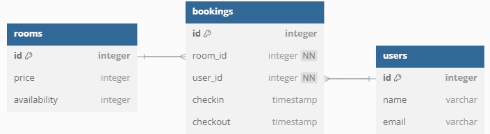

# WAD - Web Application Document - Módulo 2 - Inteli - Projeto Individual

## Nome do Aluno
- <a href="https://github.com/CaduQuaglia">Carlos Eduardo Serrano Quaglia</a>

## Sumário

[1. Introdução](#c1)

[2. Modelo Relacional do Banco de Dados](#c2)

[3. Modelo Físico do Banco de Dados](#c3)

 

# 1. Introdução

### O projeto se trata de uma aplicação web utilizada por um hotel, "Carlos Hotel", para que hóspedes reservem quartos. O sistema gerencia os dados de todos os hóspedes assim como a disponibilidade e precificação dos quartos, garantindo que não ocorra conflito entre as reservas.  
### A aplicação utiliza node.js, express.js seguindo o modelo MVC e PostgreSQL como banco de dados.

# 2. Modelo Relacional do Banco de Dados
 

# 3. Modelo Físico do Banco de Dados
~~~~sql
CREATE TABLE "rooms" (
  "id" integer PRIMARY KEY,
  "price" integer,
  "availability" integer
);

CREATE TABLE "users" (
  "id" integer PRIMARY KEY,
  "name" varchar,
  "email" varchar
);

CREATE TABLE "bookings" (
  "id" integer PRIMARY KEY,
  "room_id" integer NOT NULL,
  "user_id" integer NOT NULL,
  "checkin" timestamp,
  "checkout" timestamp
);

ALTER TABLE "bookings" ADD FOREIGN KEY ("room_id") REFERENCES "rooms" ("id");

ALTER TABLE "bookings" ADD FOREIGN KEY ("user_id") REFERENCES "users" ("id");
~~~~
