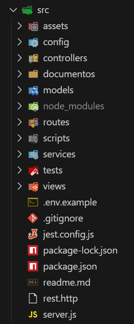

# Sistema de Reservas para o Hotel Fictício "Carlos Hotel"
Desenvolvido em Node.js com PostgreSQL seguindo o modelo MVC

Estrutura de Diretórios
-----------------------
 
* **`config/`**: Configurações do banco de dados e outras configurações do projeto.
* **`controllers/`**: Controladores da aplicação (lógica de negócio).
* **`models/`**: Modelos da aplicação (definições de dados e interações com o banco de dados).
* **`routes/`**: Rotas da aplicação.
* **`tests/`**: Testes automatizados.
* **`views/`**: Views da aplicação.

Scripts para Rodar Localmente
-------------------
No diretório "src" do projeto:
* `node server.js` ou `npm start`
